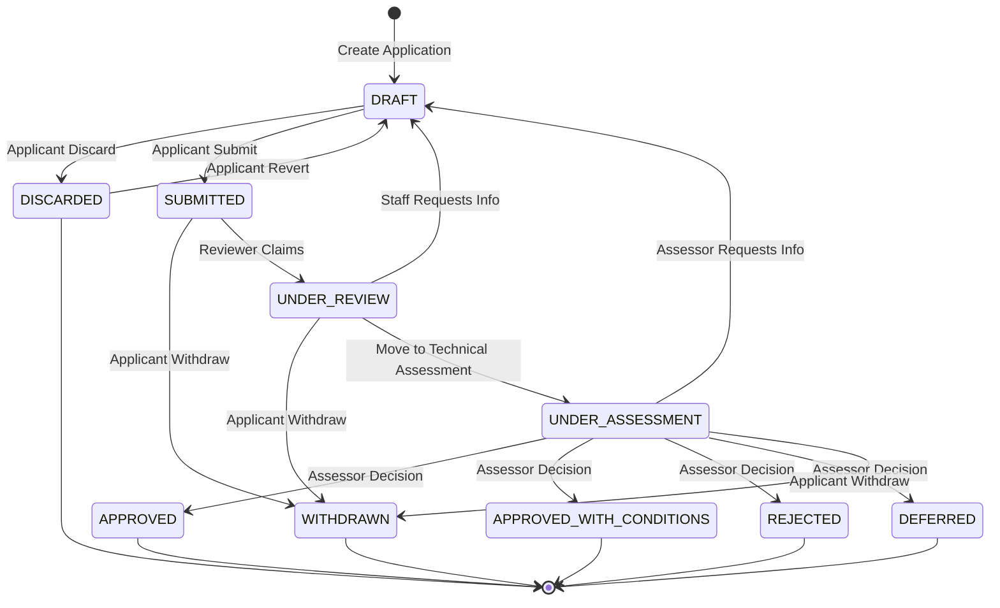

# Application Workflow and Status Transitions

This document defines the lifecycle of an application within the Authorisations system, describing the meaning of each status and the permitted transitions between them.

## Roles and Responsibilities

This system recognises three distinct roles in the application lifecycle:

*   **Applicant**: The user who initiates and owns the application. Responsible for providing data and responding to requests for more information.
*   **Reviewer**: Responsible for the initial triage and administrative check of the application. They ensure the application is complete and meets basic requirements before it moves to assessment.
*   **Assessor**: Responsible for the technical or regulatory evaluation of the application content. They provide the final recommendation or decision (Approve/Reject/Defer).

*Note: Depending on the specific Authorisation Process, a single user may act as both Reviewer and Assessor.*

## Status Definitions and Categories

Statuses are organised by workflow phase and grouped into operational categories based on their business impact:

### 1. Drafting Phase — Active & Terminated Statuses

*   **DRAFT** (Active): The initial state when an applicant starts a new application. The record is private to the applicant and not visible to staff. This status is also used when an application is returned by a Reviewer/Assessor for modification. Applicants can edit the application freely.
*   **DISCARDED** (Terminated): A terminal state for applications that the applicant decided not to proceed with before submission. Applicants can revert discarded applications back to DRAFT to restore them for further editing or submission.

### 2. Review Phase — Active & Terminated Statuses

*   **SUBMITTED** (Active): The applicant has finalised the form. The application is now locked for editing and enters the staff review queue.
*   **WITHDRAWN** (Terminated): A terminal state for applications retracted by the applicant at any time prior to a final decision. Once withdrawn, an application cannot be restored.
*   **UNDER_REVIEW** (Active): Administrative triage has started. This provides feedback to the applicant that their submission is being actively assessed. The reviewer may request additional information by returning the application to DRAFT.

### 3. Assessment Phase — Active Statuses

*   **UNDER_ASSESSMENT** (Active): Technical or regulatory evaluation phase. This indicates the administrative checks have passed and the content is being scrutinised for a final decision.

### 4. Outcome Phase — Finalised Statuses

All terminal decisions (except Deferral) can include a **Decision Comment** explaining the rationale, conditions, or feedback.

*   **APPROVED** (Finalised): Regulatory approval granted. The application has met all requirements.
*   **APPROVED_WITH_CONDITIONS** (Finalised): Approval granted subject to specific constraints or future requirements. Applicants are notified of the conditions.
*   **REJECTED** (Finalised): Application refused with specific feedback provided.
*   **DEFERRED** (Finalised): The application is valid, but a decision cannot be made at this time (e.g., pending external dependencies or seasonal constraints). Applicants may reapply or await administrative action once requirements are met.

---

## Status Category Summary

The system uses three operational categories to manage application concurrency and business rules:

| Category | Statuses | Business Rules |
| :--- | :--- | :--- |
| **Active** | DRAFT, SUBMITTED, UNDER_REVIEW, UNDER_ASSESSMENT | The system warns applicants if they already have an active application for the same process, but does not prevent multiple active applications. Users are encouraged to focus on one application at a time. |
| **Terminated** | DISCARDED, WITHDRAWN | Applications stopped before reaching a final decision. Discarded applications can be reverted to DRAFT. Terminated applications do not block new submissions for the same process. |
| **Finalised** | APPROVED, APPROVED_WITH_CONDITIONS, REJECTED, DEFERRED | Applications that have reached a final decision outcome. Finalised applications are immutable and do not block new submissions. |

---

---

## Transition Responsibility Matrix

| Status From | Status To | Responsibility | Context |
| :--- | :--- | :--- | :--- |
| (Any) | **DRAFT** | System / Applicant | Created on start OR "action required" return |
| **DRAFT** | **DISCARDED** | Applicant | User abandons draft |
| **DRAFT** | **SUBMITTED** | Applicant | User completes submission |
| **DISCARDED** | **DRAFT** | Applicant | User reverts the discard decision |
| **SUBMITTED** | **WITHDRAWN** | Applicant | User retracts application |
| **SUBMITTED** | **UNDER_REVIEW** | Reviewer | Staff begins administrative review |
| **UNDER_REVIEW** | **DRAFT** | Reviewer | Staff requests additional information |
| **UNDER_REVIEW** | **WITHDRAWN** | Applicant | User retracts application during review |
| **UNDER_REVIEW** | **UNDER_ASSESSMENT** | Reviewer | Administrative checks passed |
| **UNDER_ASSESSMENT** | **DRAFT** | Assessor | Assessor requests additional information |
| **UNDER_ASSESSMENT** | **WITHDRAWN** | Applicant | User retracts application before final decision |
| **UNDER_ASSESSMENT** | **APPROVED** | Assessor | Final decision |
| **UNDER_ASSESSMENT** | **APPROVED_WITH_CONDITIONS** | Assessor | Final decision |
| **UNDER_ASSESSMENT** | **REJECTED** | Assessor | Final decision |
| **UNDER_ASSESSMENT** | **DEFERRED** | Assessor | Final decision (held) |

---

## Business Rules

1.  **Linear Progression**: Applications must follow the defined order (Draft -> Submitted -> Review -> Assessment -> Decision) to ensure regulatory integrity.
2.  **Immutability**: Applications are read-only for applicants in any state other than `DRAFT`.
3.  **"Action Required" Pattern**: Instead of a dedicated status, "Action Required" is achieved by moving the application back to `DRAFT`. This simplifies the state machine while allowing full editing.
4.  **Discard and Revert**: Applicants can discard a draft application, moving it to the `DISCARDED` terminal state. Discarded applications can be reverted back to `DRAFT` to restore them for further editing or submission. Once reverted, they behave identically to newly created draft applications.
5.  **Concurrent Applications**: The system warns applicants when attempting to create a new application if they already have an active application for the same process, but does not prevent multiple concurrent applications. Users are encouraged to complete or abandon existing applications before starting new ones for the same process.
6.  **Audit Trail**: All status transitions made by reviewers and assessors are automatically recorded in the `ApplicationAuditLog` table for regulatory compliance and investigation purposes. Each transition captures the application, the user who made the change, the previous status, the new status, and a UTC timestamp. See [BACKEND-CONVENTIONS.md](BACKEND-CONVENTIONS.md#audit-logging-for-reviewer-and-assessor-actions) for implementation details.
7.  **Submission Timestamp Reset**: When a reviewer or assessor returns an application to `DRAFT` status (requesting additional information or re-submission), the `submitted_at` timestamp is cleared to `null`. This ensures that if the applicant resubmits, a fresh `internal_id` suffix will be generated based on the new submission date, which is essential for regulatory tracking where submissions in different months must have distinct identifiers.
8.  **Withdrawing**: Applicants can withdraw at any point prior to a final decision. Subsequent revoking of an `APPROVED` application is a separate administrative process not covered by this workflow.

