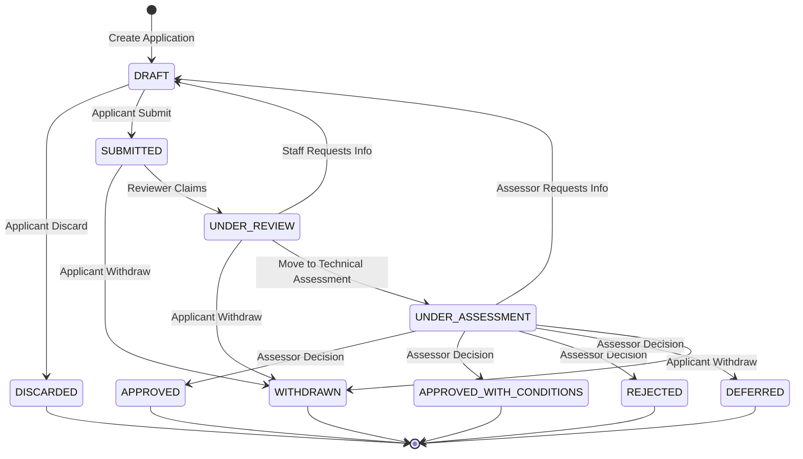

# Application Workflow and Status Transitions

This document defines the lifecycle of an application within the Authorisations system, describing the meaning of each status and the permitted transitions between them.

## Roles and Responsibilities

This system recognises three distinct roles in the application lifecycle:

*   **Applicant**: The user who initiates and owns the application. Responsible for providing data and responding to requests for more information.
*   **Reviewer**: Responsible for the initial triage and administrative check of the application. They ensure the application is complete and meets basic requirements before it moves to assessment.
*   **Assessor**: Responsible for the technical or regulatory evaluation of the application content. They provide the final recommendation or decision (Approve/Reject/Defer).

*Note: Depending on the specific Authorisation Process, a single user may act as both Reviewer and Assessor.*

## Status Definitions

### 1. Drafting Phase (Applicant Controlled)

*   **DRAFT**: The initial state when an applicant starts a new application. The record is private to the applicant and not visible to staff. This status is also used when an application is returned by a Reviewer/Assessor for modification.
*   **DISCARDED**: A terminal state for applications that the applicant decided not to proceed with *before* submission.

### 2. Review Phase (Reviewer/Assessor Controlled)

*   **SUBMITTED**: The applicant has finalised the form. The application is now locked for editing and enters the staff queue.
*   **WITHDRAWN**: A terminal state for applications retracted by the applicant. Can occur at any time *prior* to a final decision.
*   **UNDER_REVIEW**: Administrative triage has started. This provides feedback to the applicant that their submission is being actively looked at.

### 3. Assessment Phase (Assessor Controlled)

*   **UNDER_ASSESSMENT**: Technical/regulatory evaluation phase. This indicates the administrative checks are passed and the content is being scrutinised for a decision.

### 4. Outcome Phase (Terminal Decisions)

All terminal decisions (except Deferral) can include a **Decision Comment** explaining the rationale, conditions, or feedback.

*   **APPROVED**: Regulatory approval granted.
*   **APPROVED_WITH_CONDITIONS**: Approval granted subject to specific constraints or future requirements.
*   **REJECTED**: Application refused with specific feedback provided.
*   **DEFERRED**: A final state indicating that while the application is valid, a decision cannot be made at this time (e.g., pending external dependencies or seasonal constraints). A project may be approved later but would typically require a new assessment or specific administrative action once requirements are met.

---

## Workflow Diagram

---

## Transition Responsibility Matrix

| Status From | Status To | Responsibility | Context |
| :--- | :--- | :--- | :--- |
| (Any) | **DRAFT** | System / Staff | Auto-created on start OR "Action Required" return |
| **DRAFT** | **DISCARDED** | Applicant | User abandons draft |
| **DRAFT** | **SUBMITTED** | Applicant | User completes submission |
| **SUBMITTED** | **WITHDRAWN** | Applicant | User retracts application |
| **SUBMITTED** | **UNDER_REVIEW** | Reviewer | Staff begins administrative review |
| **UNDER_REVIEW** | **UNDER_ASSESSMENT**| Reviewer | Administrative checks passed |
| **UNDER_ASSESSMENT** | **APPROVED** | Assessor | Final decision |
| **UNDER_ASSESSMENT** | **REJECTED** | Assessor | Final decision |
| **UNDER_ASSESSMENT** | **DEFERRED** | Assessor | Final decision (held) |

---

## Business Rules

1.  **Linear Progression**: Applications must follow the defined order (Draft -> Submitted -> Review -> Assessment -> Decision) to ensure regulatory integrity.
2.  **Immutability**: Applications are read-only for applicants in any state other than `DRAFT`.
3.  **"Action Required" Pattern**: Instead of a dedicated status, "Action Required" is achieved by moving the application back to `DRAFT`. This simplifies the state machine while allowing full editing.
4.  **Audit Trail**: High-level status transitions and decision comments will be captured via Django Admin log entries (`LogEntry`) to avoid manual schema overhead for internal auditing.
5.  **Withdrawing**: Applicants can withdraw at any point prior to a final decision. Subsequent revoking of an `APPROVED` application is a separate administrative process not covered by this workflow.

